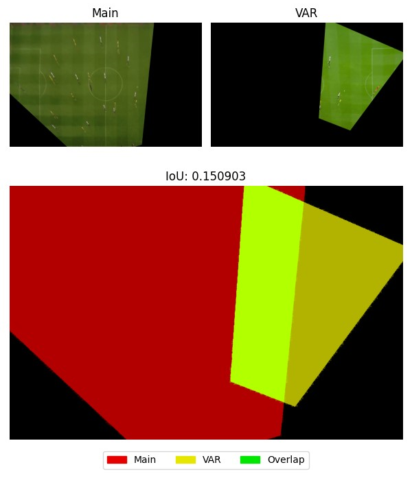
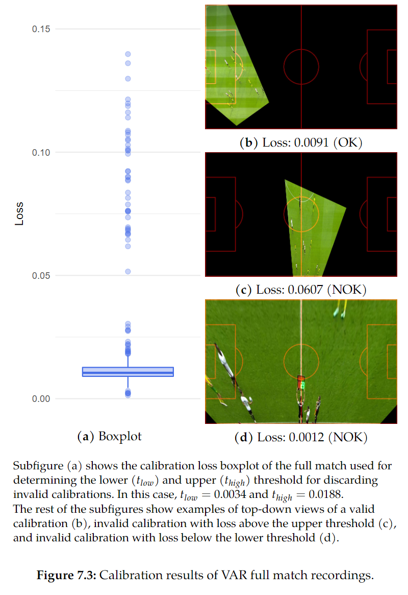

# Autocam Evaluation

This is a system for evaluating the Autocam output developed within the [master's thesis](https://is.muni.cz/th/l78dh/?lang=en) by Attila Zsíros in 2023.

The evaluation metric is the Intersection over Union (IoU) of the top-down projected estimated (main) and reference (VAR) frames, as shown in the figure.



## Getting Started

1. Initialize all submodules:
  
    ```shell
    git submodule update --init --recursive
    ```

2. Download the pretrained segmentation model for TVCalib:

    ```shell
    mkdir -p assets/weights/segment_localization
    wget https://tib.eu/cloud/s/x68XnTcZmsY4Jpg/download/train_59.pt -O assets/weights/segment_localization/train_59.pt
    ```

3. Create a [Conda environment](https://docs.conda.io/en/latest/) by first installing, e.g., [Miniconda](https://docs.conda.io/projects/miniconda/en/latest/miniconda-install.html) and then running:

    ```shell
    conda env create -f environment.yml
    conda activate tvcalib
    ```

4. Compare individual frames from sample clips by:

    ```shell
    make evaluate_show
    ```

## Dataset Directory Structure

The dataset paths are configured in the `configs/config_eval.yaml` file. The command `make evaluate` assumes the following directory structure:

```shell
<main_path>
├── p0_shot1_frames
|   └── p0_shot1_0000_warped.jpg
|   └── p0_shot1_0001_warped.jpg
|   └── p0_shot1_0002_warped.jpg
|   └── ...
├── p0_shot2_frames
|   └── p0_shot2_0000_warped.jpg
|   └── p0_shot2_0001_warped.jpg
|   └── p0_shot2_0002_warped.jpg
|   └── ...
├── ...

--------------------------------

<var_path>
├── p0_shot1_frames
|   └── p0_shot1_0000_warped.jpg
|   └── p0_shot1_0001_warped.jpg
|   └── p0_shot1_0002_warped.jpg
|   └── ...
├── p0_shot2_frames
|   └── p0_shot2_0000_warped.jpg
|   └── p0_shot2_0001_warped.jpg
|   └── p0_shot2_0002_warped.jpg
|   └── ...
├── ...
```

## Evaluation Pipeline

This pipeline accepts as input a folder with VAR clips, specified in `configs/config_eval.yaml` under `var_path`, and performs the evaluation between these clips and the clips specified under `main_path`.


1. **Export VAR Frames:** Export a frame every `n` seconds (specified in the config file) from the VAR footage. The exported frames are saved in directories based on clip names. 

    ```shell
    make export_var_frames
    ```

2. **Calibrate the VAR Frames:** Transform the VAR frames into a unified top-down view using the [TVCalib](https://github.com/mm4spa/tvcalib). Creates files with a `_warped` suffix and exports a `losses.csv` file containing the segment reprojection loss of each frame.

    ```shell
    make calibrate
    ```

3. **Evaluate:** Calculate the IoU of the projected frames. The exported `evaluation.csv` file contains the IoU for each compared pair, and the `results.txt` file contains a summary of the IoUs both for each clip individually and the whole clips folder.

    ```shell
    make evaluate

    # Optionally: Export the overlap visualizations during evaluation.
    make evaluate_fig_save
    ```

The whole evaluation pipeline can be executed by `make all`.

**Note:** The Autocam system outputs the warped images during estimation, so there is no need to export and calibrate the estimated frames.


## Methods

For calibration, the [TVCalib](https://github.com/mm4spa/tvcalib) method is utilized. For a detailed description of the methods, refer to the [master's thesis](https://is.muni.cz/th/l78dh/?lang=en).



## Cite

```bibtex
@MastersThesis{Zsiros2023,
  AUTHOR = "Zsíros, Attila",
  TITLE = "Automatic virtual soccer camera",
  YEAR = "2023",
  SCHOOL = "Masarykova univerzita, Fakulta informatiky, Brno",
  URL = "https://is.muni.cz/th/l78dh/",
}
```
